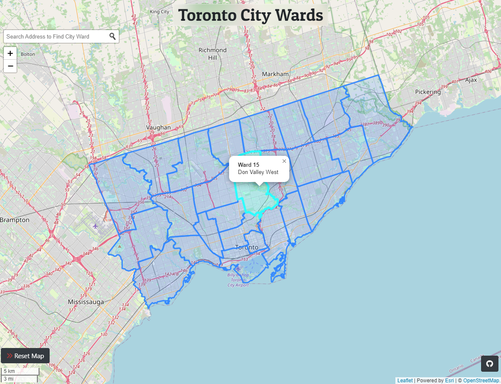
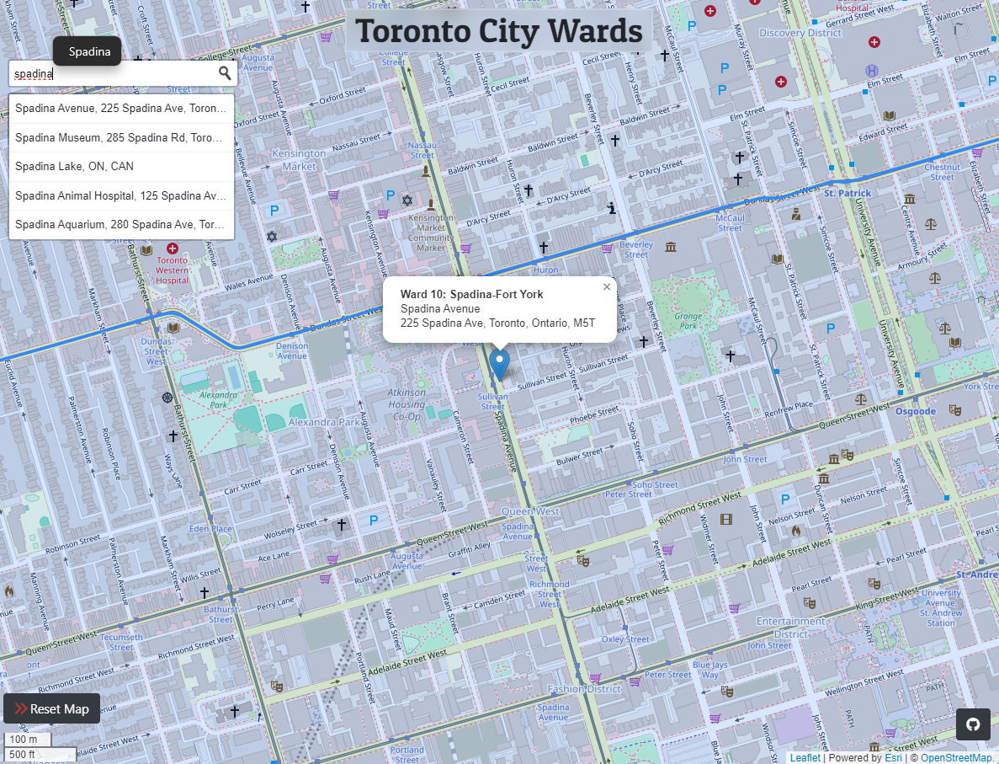

# Map of Toronto City Wards
Leaflet map displaying Toronto City Ward boundaries.

🏹 View on browser: https://glowiep.github.io/toronto-city-wards/

The search bar can be used to locate an address and obtain information about the city ward boundary it falls under.

## 🏆 Goals
- Display GeoJSON polygon on a Leaflet web map.
- Show GeoJSON polygon details in pop-ups.

## 🔧 Dependencies
- jQuery
- Leaflet
- Bootstrap
- <a href="https://www.npmjs.com/package/@turf/turf">turf JS </a>
- <a href="https://fonts.google.com/specimen/Patua+One?preview.text=Toronto%20City%20Wards">Google Fonts</a>

## 💡 Sources
- Toronto Open Data Portal: <a href="https://open.toronto.ca/dataset/city-wards/">City Wards</a>